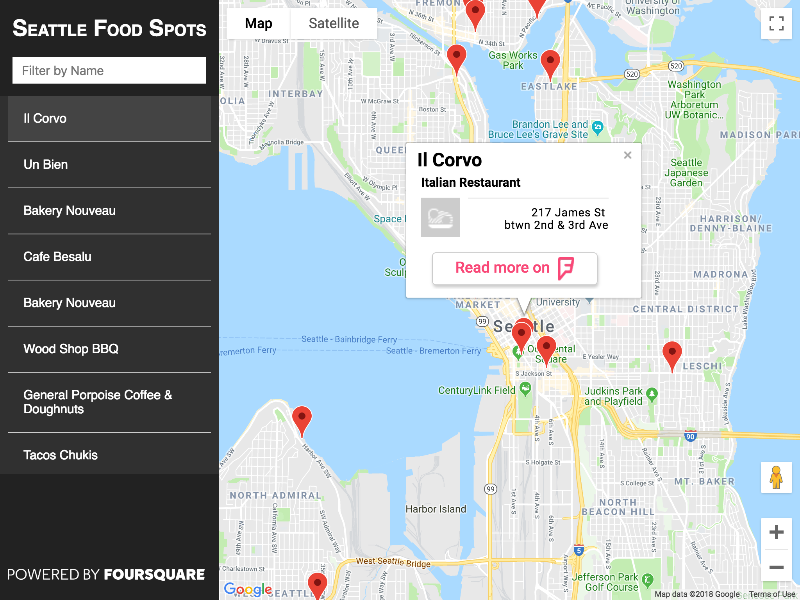
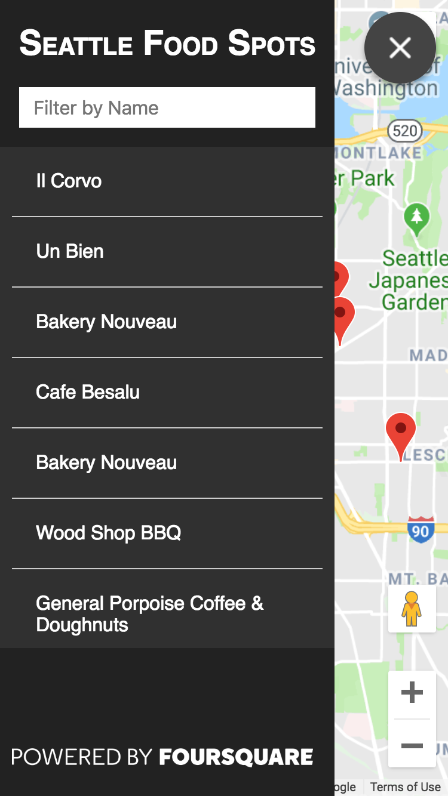
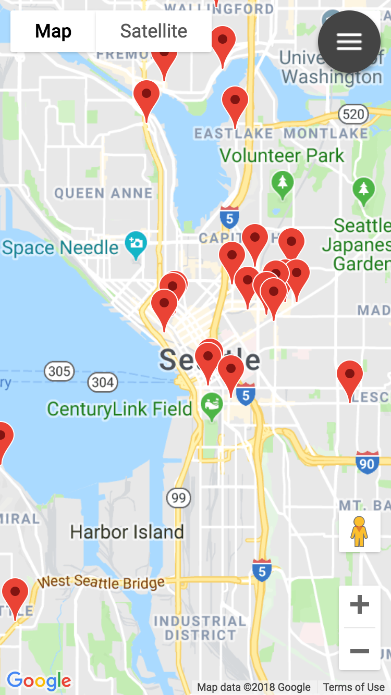

# Neighborhood Map

## Carlo Bruno | Udacity Front End Nanodegree

### Project \#7 React + Google Maps + Foursquare API

## Table of Contents

- [Introduction](#introduction)
- [How to Use](#how-to-use)
- [For Developers](#for-developers)
- [Building the App](#building-the-app)

## Introduction

This is a single page map application that shows food venues around Seattle area.

The page consist of a Google Map and Location markers. The sidebar contains the list of all the venues. Clicking either the markers or list items will open an InfoWindow that shows more details about the venue.



### Project Specification

This project is to demonstrate a good understanding of React.js architecture, working with API's, creating Responsive Design and Accessibility compliant UI.

---

## How to Use

This App showcases popular food venues in Seattle. The Map displays the markers for each venue. We can also find this same list of venues on the sidebar. An text input box in the sidebar gives us a filter functionality by showing places that match our search query.

The InfoWindow displays more details about the venue, namely, the restaurant category, the exact address, and a link to visit its Foursquare page.

In mobile viewports, a toggle button for the menu appears in the upper-right corner of the screen. Pressing it will slide the sidebar on and off the screen.




### For Developers

This was created using `create-react-app`, and you can either run it in development or in production mode.

1. Clone this [repo](https://github.com/carlo-bruno/udacity-fend-project-neighborhood) or
   `git clone https://github.com/carlo-bruno/udacity-fend-project-neighborhood.git`
2. Go to the application folder, install dependencies using `npm install`
3. Run the application `npm start`
4. Open your browser to `localhost:3000`

## Building the App

This is how structured my React Components

```bash
├── <App /> # Stateful Component, handles the state and api requests
    │       # as well as rendering Google maps, markers and InfoWindow
    └─ <ListView /> # Stateless Component, contains the list of locations
                    # the title, and Foursquare attribution
```

### Built with

- [Create React App](https://github.com/facebookincubator/create-react-app)
- [React 16](https://reactjs.org/)
- [Google Maps API](https://developers.google.com/maps/documentation/)
- [Foursquare Places API](https://developer.foursquare.com/)
- [Axios](https://github.com/axios/axios)

### Tutorials and ideas

- [Foursquare Places API Documentation](https://developer.foursquare.com/docs/api/venues/explore)
- [Project 7 Playlist by Elharony](https://www.youtube.com/watch?v=ywdxLNjhBYw&list=PLgOB68PvvmWCGNn8UMTpcfQEiITzxEEA1)
- [Project 7 Tutorial by Ryan Waite](https://www.youtube.com/watch?v=LvQe7xrUh7I&t=165s)
- [Web Accessibility Checklist](https://a11yproject.com/checklist)
